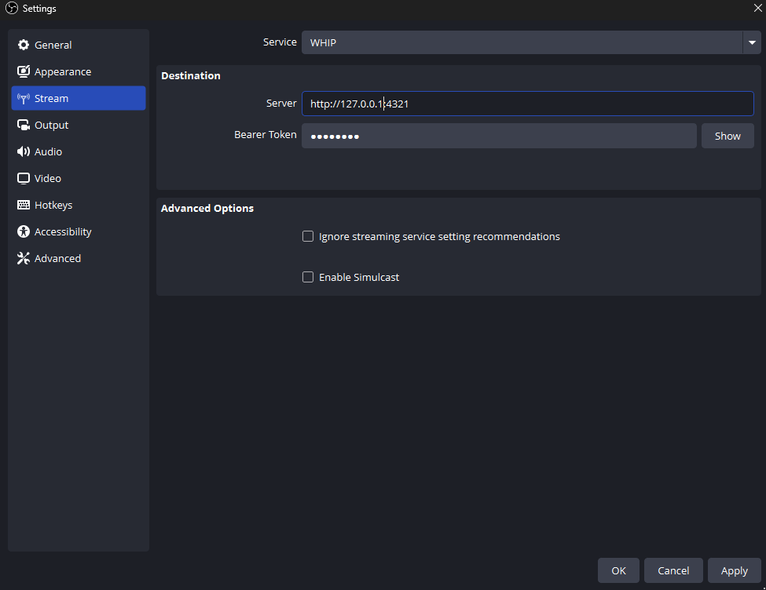
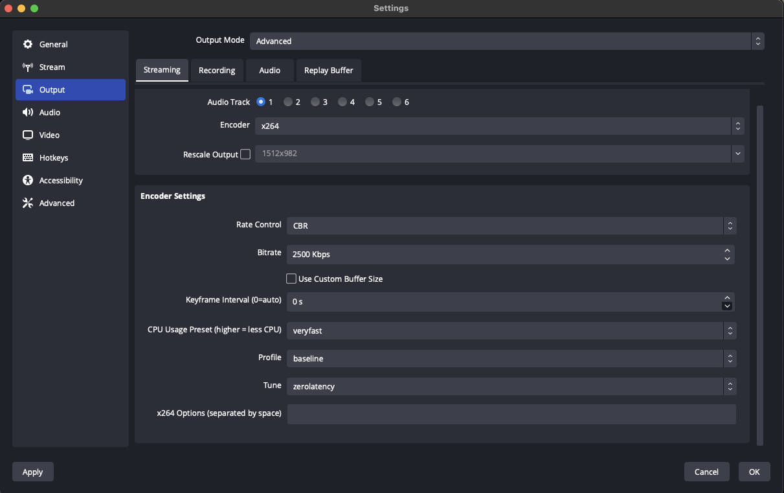
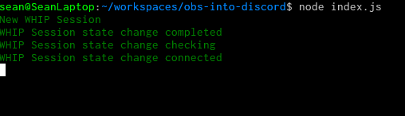

# OBS Into Discord

[![License][license-image]][license-url]
[![Discord][discord-image]][discord-invite-url]

- [What is OBS Into Discord](#what-is-obs-into-discord)
- [Setup](#setup)
- [Using](#using)
- [TODO](#todo)
- [More](#more)

## What is OBS Into Discord

This project allows you to send video from OBS directly into Discord.
The video is not transcoded or modified in any way. What you send is
then sent directly to discord.

As a user this gives you
* Higher quality video. Tune your encoding settings!
* Better platform support. Get audio for Linux screenshares.
* More customization. Custom layouts/capture multiple windows....

This projects accepts WebRTC (WHIP) clients using [werift-webrtc](https://github.com/shinyoshiaki/werift-webrtc). It then bridges this
into Discord using [dank074/Discord-video-stream](https://github.com/dank074/Discord-video-stream). This project also supports more then
just OBS. You can also use any client that support WHIP.

* [GStreamer](https://gstreamer.freedesktop.org/documentation/webrtchttp/whipsink.html?gi-language=c)
* [Larix Broadcaster](https://softvelum.com/larix/)
* [FFmpeg](https://github.com/ossrs/ffmpeg-webrtc)
* [Web Browser](https://github.com/Eyevinn/whip)

## Setup

### Download

`git clone https://github.com/Sean-Der/obs-into-discord.git`

### Install Dependencies

`cd obs-into-discord && npm install`

### Set `userToken` in `config.json`

Getting the `userToken` is the hardest step. I found these guides the most useful

* https://gist.github.com/MarvNC/e601f3603df22f36ebd3102c501116c6
* https://www.geeksforgeeks.org/how-to-get-discord-token/

### Set `serverIdNumber` and `channelIdNumber`

Follow the official documentation [here](https://support.discord.com/hc/en-us/articles/206346498-Where-can-I-find-my-User-Server-Message-ID)

### Change `httpPort` if 4321 isn't available

In most cases you will not to change this. Only ff port 4321 is already used by another service.

## Using

Run `node index.js`. If it starts without errors you have configured everything correctly. You now have a WHIP -> Discord bridge
running on port 4321. Publish from OBS via WHIP to `http://localhost:4321`. Currently you can do any streamKey (this may change in the future)

The following encoding settings are recommended. You can try tuning these, but may
see inconsistent playbcak behavior

If everything worked you should see the following output in the console.

## TODO

* [ ] Allow configuration via Web UI
* [ ] Creater Docker Image
* [ ] Upload to Dockerhub
* [ ] Create [executable](https://nodejs.org/api/single-executable-applications.html) for easier install
* [ ] Support H265
* [ ] Support AV1
* [ ] Lower Latency

## More

For self hosting see [Broadcast Box](https://github.com/glimesh/broadcast-box). With Broadcast Box you can broadcast
with 150Ms of latency and push any video quality you want. No bitrate or codec restrictions!

[Join the Discord][discord-invite-url] and we are ready to help!

[license-image]: https://img.shields.io/badge/License-MIT-yellow.svg
[license-url]: https://opensource.org/licenses/MIT
[discord-image]: https://img.shields.io/discord/1162823780708651018?logo=discord
[discord-invite-url]: https://discord.gg/An5jjhNUE3
